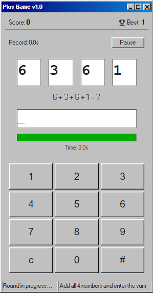
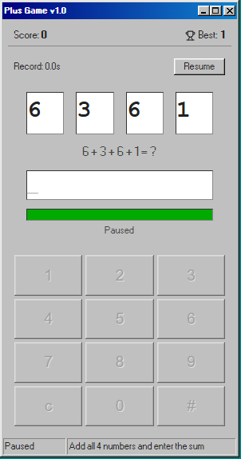
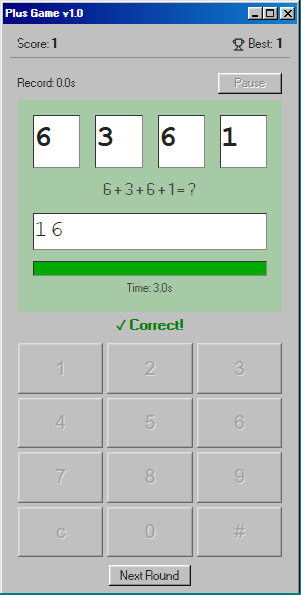
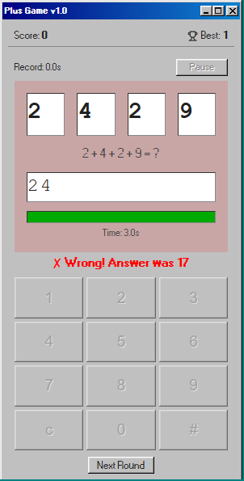
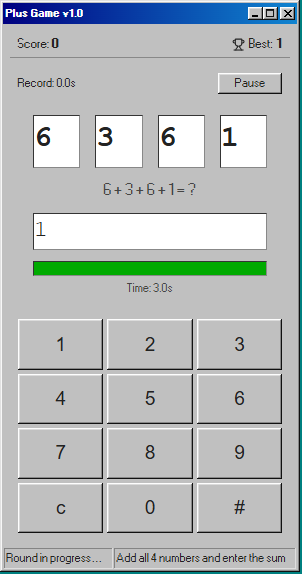

# Plus Game

A fast-paced mental arithmetic game styled with a retro Windows 98 aesthetic (98.css).  
Add four single-digit numbers against the clock. Build the longest correct streak you can — and keep your Record Time as low as possible.



---

## Table of Contents

- [Project Overview](#project-overview)
- [Tech Stack](#tech-stack)
- [Getting Started](#getting-started)
- [How to Play](#how-to-play)
- [Keyboard Shortcuts](#keyboard-shortcuts)
- [Scoring System](#scoring-system)
- [Record Time](#record-time)
- [Game States & Flow](#game-states--flow)
- [Algorithms & Implementation Details](#algorithms--implementation-details)
- [Project Structure](#project-structure)

---

## Project Overview

Plus Game displays four random single-digit numbers and asks the player to type their sum within a 3-second countdown. Rounds are fully manual — you decide when to continue. Every correct answer extends your streak and adds to your Record Time.

---

## Tech Stack

| Technology | Purpose |
|---|---|
| React 18 + TypeScript | UI and game logic |
| Vite | Build tool and dev server |
| [98.css](https://jdan.github.io/98.css/) | Windows 98 visual theme |
| [lucide-react](https://lucide.dev/) | Icons |
| localStorage | High score persistence |

---

## Getting Started

```bash
npm install
npm run dev       # development server
npm run build     # production build
npm run preview   # preview production build
```

---

## How to Play

1. Four single-digit numbers appear on screen, e.g. `3 + 7 + 2 + 5`.
2. Type the correct sum using the on-screen keypad or your keyboard.
3. The answer submits automatically the moment you type the correct value — no need to press Enter.
4. If you type a wrong digit you can backspace and try again, but the 3-second timer keeps running.
5. When the timer runs out, the game checks your typed value:
   - If it matches the correct answer, it still counts as correct.
   - Otherwise it is a timeout loss.
6. After every round result (correct, wrong, or timeout) the game pauses and waits for you to start the next round manually.

| Active Round | Paused |
|:---:|:---:|
|  |  |

| ✓ Correct Answer | ✗ Wrong Answer |
|:---:|:---:|
|  |  |

---

## Keyboard Shortcuts

| Key | Action |
|---|---|
| `0`–`9` / Numpad | Type a digit |
| `Enter` | Submit current input |
| `Backspace` | Delete last digit |
| `Space` | Pause / Resume the timer |
| `Space` *(after round ends)* | Start the next round |

---

## Scoring System

- **Score** — counts consecutive correct answers in the current session streak.
- Any wrong answer or unanswered timeout resets the score to **0**.
- **Best** (high score) — the highest streak ever reached, stored in `localStorage` under the key `plusgame_highscore` and persisted across sessions.

---

## Record Time

Record Time is the **cumulative time you actually spent answering** across your current streak of correct rounds.

### How it is calculated

```
Record Time = Σ (ROUND_DURATION − timeLeft)  for each correct round in the streak
```

**Example:**

| Round | timeLeft when answered | Time used |
|---|---|---|
| 1 | 2.0 s remaining | 3.0 − 2.0 = **1.0 s** |
| 2 | 1.5 s remaining | 3.0 − 1.5 = **1.5 s** |
| 3 | 0.8 s remaining | 3.0 − 0.8 = **2.2 s** |
| **Record Time** | | **4.7 s** |

- The clock **stops the moment the correct answer is detected** — whether you typed it before the timer ran out or the timer expired with the right digits already entered.
- Record Time resets to **0** whenever a round ends incorrectly (wrong answer or empty timeout), mirroring the score reset.
- Lower Record Time = faster correct answers = better performance.



---

## Game States & Flow

```
initialState
     │
     ▼
  isActive = true  ──► timer running ──► player types
     │                                        │
     │                              answer matches? ──► resolveRound('correct', true)
     │                              timer expires?  ──► resolveRound('correct'/'timeout', …)
     │                              Enter pressed?  ──► resolveRound('correct'/'wrong', …)
     │
     ▼
  isActive = false, isWaitingForNext = true
  (feedback shown, timer stopped)
     │
     ▼
  Player presses Space or clicks "Next Round"
     │
     ▼
  startRound() → new numbers, timer reset, roundId++
```

**Pause** is only available while a round is actively running (`isActive && timeLeft > 0`).  
Pressing `Space` during an active round toggles pause/resume; after a round ends it starts the next round.

---

## Algorithms & Implementation Details

### Number generation

```ts
function generateNumbers(): number[] {
  return Array.from({ length: 4 }, () => Math.floor(Math.random() * 10));
}
```

Produces four independent uniform random integers in `[0, 9]`.  
The correct sum therefore ranges from **0** to **36**.

### Auto-submit on digit entry

Instead of requiring the player to press Enter, every digit key event computes the running input and immediately resolves the round if it already equals the correct answer:

```ts
const newInput = state.input + key;
const answer = state.numbers.reduce((a, b) => a + b, 0);
if (parseInt(newInput, 10) === answer) {
  resolveRound('correct', true);
}
```

This means a 2-digit correct answer resolves on the second digit, and a 1-digit answer (e.g. sum = 7) resolves the moment `7` is pressed.

### Countdown timer (`useTimer` hook)

The timer uses **wall-clock delta correction** to prevent cumulative drift from `setInterval` jitter:

```ts
const elapsed = (now - lastTickTimeRef.current) / 1000;
const newRemaining = Math.max(0, remainingRef.current - elapsed);
```

Each tick subtracts the real elapsed milliseconds since the previous tick, not a fixed 0.1 s step.  
The interval fires every **100 ms** for a smooth progress bar.

The timer respects three stop conditions via a single `useEffect` dependency:

| Condition | Timer state |
|---|---|
| `active = false` | Stopped |
| `paused = true` | Stopped (resumes from current `remainingRef`) |
| `waitingForNext = true` | Stopped (round is over) |

A `resetSignal` (the `roundId`) triggers a separate `useEffect` that resets `remainingRef` only when a new round starts, so pausing and resuming does not reset the clock.

### Score & Record Time update (single atomic setState)

Both values are computed inside the same `setState` updater function to guarantee they are always in sync and never read stale state:

```ts
const timeUsed = ROUND_DURATION - prev.timeLeft;
const newRecordTime = isCorrect ? prev.recordTime + timeUsed : 0;
const newScore     = isCorrect ? prev.score + 1          : 0;
```

### High score persistence

The high score is written to `localStorage` only when a new high is reached, and is wrapped in a `try/catch` so the game works in environments where `localStorage` is unavailable (private browsing, sandboxed iframes).

---

## Project Structure

```
src/
├── App.tsx                 # Root component: all game state and logic
├── main.tsx                # React entry point
├── index.css               # Global styles
├── components/
│   ├── Display.tsx         # Numbers, input box, progress bar, feedback overlay
│   ├── Keypad.tsx          # 3×4 on-screen keypad (mouse/touch)
│   └── ErrorBoundary.tsx   # React error boundary wrapper
├── hooks/
│   └── useTimer.ts         # Drift-corrected countdown timer hook
└── types/
    └── index.ts            # Shared TypeScript types and interfaces
```
